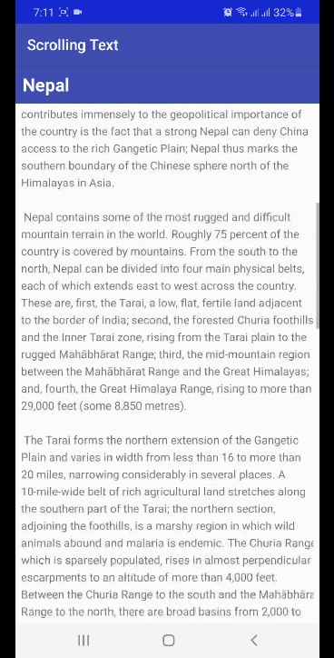
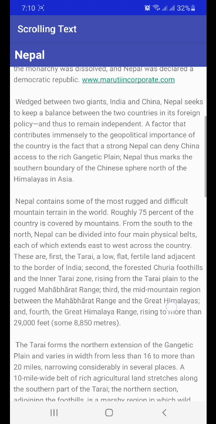

## Text and scrolling views

## Coding Challenge

## Homework

## Question 1
How many views can you use within a ScrollView? Choose one: 
One view only 
One view or one view group 
As many as you need 
<b>Answer:</b> One view or one view group 
## Question 2
Which XML attribute do you use in a LinearLayout to show views side by side? Choose one: 
android:orientation="horizontal" 
android:orientation="vertical" 
android:layout_width="wrap_content" 
<b>Answer:</b> android:orientation="horizontal" 
## Question 3
Which XML attribute do you use to define the width of the LinearLayout inside the scrolling view? Choose one: 
android:layout_width="wrap_content" 
android:layout_width="match_parent" 
android:layout_width="200dp" 
<b>Answer:</b> android:layout_width="match_parent" 
